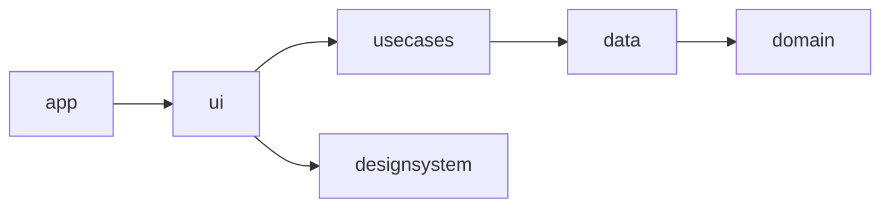
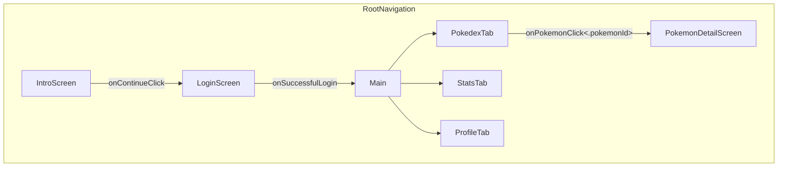

# Architecture

**Snapdex** is a modern Android app built with Jetpack Compose. It serves as a production-quality showcase of scalable architecture, modular design, and practical offline-first strategies. This guide outlines the technical decisions and structural patterns used in the app.

## Context

This guide was written to demonstrate how I approach building mobile apps as a senior engineer, with a focus on clean structure, real-world trade-offs, and long-term maintainability. While Snapdex is a solo project, I’ve structured it as if I were contributing to a production app in a team setting.

I also followed platform-level best practices when deciding which Android versions to target. Since Snapdex didn’t require any cutting-edge APIs, I chose to use the Google-recommended minimum SDK version, which at the time of development was API 24 (Android 7.0). This provides compatibility with over 97% of active devices, striking a good balance between feature support and broad device coverage.

## Architectural Principles

When it comes to architecture, I strongly believe in **minimalism over over-engineering**.

I don’t start with rigid layers or textbook abstractions — I let structure emerge naturally as the app grows. For me, architecture should serve the team and the product, not just theoretical purity.

I often see design patterns and recommended architectures applied too dogmatically, where developers mistake the core intent behind the authors' words as "there's only one good implementation", or SRP == "one function per file, function should be extremely small". I couldn't agree less with that thinking. I prefer to understand the intent behind these principles and then adapt them pragmatically to my use case. 

That said, Snapdex is a portfolio project, so I intentionally leaned into a more structured, scalable approach to demonstrate what I’d do on a production team. If this were just a small personal app, I would have kept things simple.

### Layering in Snapdex
Snapdex uses a modular take on Clean Architecture to enforce separation of concerns and improve testability and scalability:

- Domain Layer – Business logic and domain models
- Data Layer – Local persistence with Room and remote access with Firestore
- Use Cases Layer - Orchestrator between local and remote data to achieve tasks requested by user
- UI Layer – Jetpack Compose screens and ViewModels built around the MVI pattern
- App Layer – Entry point and dependency wiring

Each layer lives in its own Gradle module, and convention plugins help standardize configuration across modules.

## UI Architecture

Snapdex is built using the **Model–View–Intent (MVI)** pattern to create a UI that’s both **predictable** and **testable**.

### Why MVI?

While **MVVM** is a widely used and perfectly valid pattern — one I’ve used myself since the early days of WPF development back in 2006 — I find **MVI offers a more deterministic and maintainable approach**, especially as complexity grows.

My preference for MVI also comes from my background with **Fabulous**, the open-source framework I co-created. It’s based on **MVU (Model–View–Update)**, which shares the same core concepts as MVI but comes from the F# ecosystem. What I’ve always appreciated about this pattern is its **state machine nature**: everything that happens in the UI flows through a single stream of intent-driven updates. This design naturally avoids many common issues related to concurrency, race conditions, and inconsistent state.

MVI encourages **explicitness** and **clear separation of concerns**:
- The **State** file holds all the business-related data that the UI depends on.
- The **Actions** file defines everything the user can trigger.
- The **Events** file represents one-off effects that the app wants to notify the UI about (e.g. navigation, messages).

One important design decision I made in Snapdex is to **keep the ViewModel and State focused purely on business-related data**. Anything related to UI presentation — like animation states, opacity, or navigation — is handled inside the UI itself. In other words, **the UI is responsible for UI**. This separation avoids mixing concerns and keeps the logic layer clean and easier to maintain.

MVI can feel more demanding to scale — though I see that as a strength, not a drawback. It exposes when a screen is doing too much and nudges you toward better separation of concerns. That trade-off has worked really well in Snapdex, and I’d make the same choice again for apps with similar complexity.

### UI Structure in Snapdex

- **ScreenRoot**: The entry point of each screen. It connects to the `ViewModel`, observes the `State`, and handles `Events`. It also manages navigation.
- **Screen**: A purely functional composable that takes `State` and callbacks such as `onAction` as input and renders the UI. It knows nothing about the ViewModel or navigation. This makes it easy to test and preview in isolation.
- **ViewModel**: Acts as the logic hub. It exposes an immutable `State`, accepts user `Actions`, and emits one-time `Events`.
- **Components**: Stateless, reusable composables that encapsulate styling and interactions.
- **State**: An immutable snapshot of all the **business-related** data the screen needs to render.
- **Actions**: Represent user intentions — button taps, text input, etc.
- **Events**: One-time effects like navigation, snackbars, or dialogs.

### Navigation

Snapdex uses **Jetpack Compose Navigation** with a strong emphasis on separation of concerns between screens and navigation logic.

The navigation flow is structured as follows:

- The **intro screen** is displayed only once on first launch (`hasSeenIntro`)
- The **authentication flow** is skipped entirely if a user is already signed in (`currentUser != null`)
- The **main interface** consists of three persistent tabs: **Pokedex**, **Stats**, and **Profile**
- Each tab manages its own internal navigation independently, keeping things modular and easy to reason about

Beyond the flow itself, I’ve taken care to **decouple navigation from the screens**. Instead of having screens directly perform navigation actions, the navigation layer passes down **callbacks** that the screen can invoke (e.g., `onPokemonClick(pokemonId)`). This allows the navigation host to handle:

- Dependency injection
- Parameter passing
- Navigation type (e.g., push vs. replace)

By keeping navigation logic **outside the screen**, screens remain focused solely on presenting data and handling user interactions. This separation improves readability, testability, and maintainability — especially as navigation flows become more complex.

## Design System

One of the things I really appreciate about Jetpack Compose is its approach to theming through **`CompositionLocalProvider`**. It allows you to inject values like colors or typography deep into the UI tree and even override them in localized sections when needed. This flexibility makes it easy to customize the design while keeping the code clean and declarative.

That said, integrating a custom Figma design into Jetpack Compose isn’t always straightforward — especially when the design doesn't strictly follow the **Material 3** structure. That was the case with Snapdex: the UI mockups were beautiful, but they didn’t align 1:1 with the Material Design system.

Luckily, Compose makes it simple to **define a fully custom theme**. I reused the naming conventions from the designer’s Figma file and implemented a custom color palette, typography, and shape system using `CompositionLocalProvider` and `isSystemInDarkTheme()`. This made it easy to match the design closely, ensure pixel-perfect visuals, and speak a shared language with the designer during implementation.

Once the theming layer was set, I created my own set of **custom components**, modeled after Material 3 components but tailored to Snapdex’s unique visual identity. These components consistently apply the correct values from the design system and can be easily reused across screens — or even in other projects.

### Highlights of the Snapdex Design System

- Inspired by **Material 3**, but adapted to a fully custom design
- Themed using **Composition Locals** for colors, typography, and shapes
- All components are **modular, portable**, and usable outside of this project
- Encourages consistent spacing, alignment, color usage, and interaction patterns

This setup improves UI consistency, accelerates development, and helps maintain a strong connection between design and implementation.

## Data Management

Snapdex is built around an **offline-first** philosophy. All core data is persisted locally and synced to the cloud as needed.

### Stack

- **Room** for local persistence
- **Firestore** for remote storage
- **Repositories** abstract local and remote logic
- **Domain services** coordinate business operations across sources

### Sync Strategy

- **Best-effort sync** from local to remote when performing create/update/delete operations
- **Just-in-time full sync** triggered on login or app open
- **No WorkManager** used: sync logic is simple enough to avoid background schedulers

## Authentication & Security

Snapdex uses:

- **Firebase Authentication** for user accounts
- **Encrypted local storage** to store the OpenAI API key (used for image captioning features)

Secrets are managed securely and excluded from version control.

## Testing Strategy

While Snapdex is primarily focused on architectural demonstration, the design strongly supports testability:

- ViewModels are easy to unit test due to MVI’s predictable state transitions
- Screens are pure functions, compatible with preview and screenshot testing
- Business logic lives in the `domain` layer, isolated from Android dependencies

In a team setting, I would ensure:
- Unit tests for all ViewModels and domain services
- UI tests for critical flows using Jetpack Compose Testing APIs
- Snapshot tests for visual regression

## Internationalization

Snapdex uses standard Android resource strings and supports localization out of the box. All user-facing strings are externalized for easy translation.

## Build & Tooling

Snapdex integrates modern tooling to support development, quality, and distribution.

### GitHub Actions

- Linting and formatting
- Build checks
- Unit test runner

### Code Style

- **ktfmt** for formatting
- Pre-commit hooks encouraged to enforce consistency

### Secrets Management

- Stored in `local.properties`
- Kept out of version control via `.gitignore`

### App Distribution

- **Firebase App Distribution** for tester access
- **Play Store** for production deployment